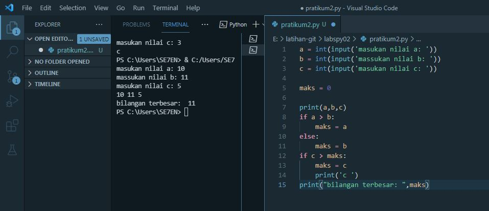
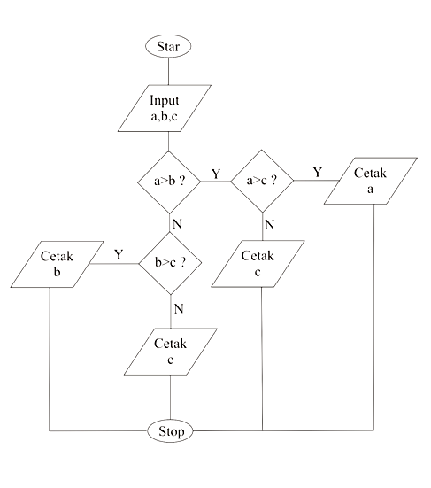

# labspy02
# algoritma
# flowchart

langkah langkahnya adalah masukan nilai a dan jika lebih besar dari b makah tampilkan nilai a dan juga jika b lebih besar maka tampilkan b apabila c lebih besar dari keduanya maka tampilkan nilai c

